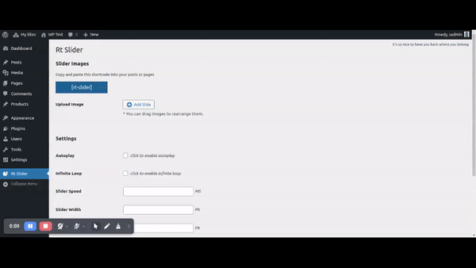
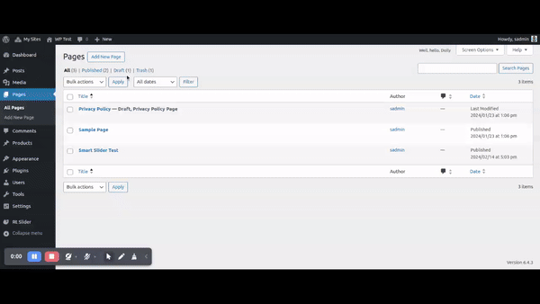

# Rt Slider Plugin

Welcome to the Rt Slider GitHub repository!

Rt Slider is an easy-to-use WordPress plugin that makes it simple to create visually appealing sliders for your website. Its user-friendly interface allows you to quickly add slider images and customize various settings to match your site's look and feel.

## Getting Started

These instructions will get you a copy of the project up and running on your local machine for development purposes.
  

### Installing 

1.  Download the Rt Slider plugin ZIP file from the [plugin repository](https://github.com/swapnilghone/rt-slider)
2. Log in to your WordPress admin panel.
3. Navigate to the "Plugins" section and click on "Add New." Click on the "Upload Plugin" button at the top of the page
4. Choose the ZIP file you downloaded earlier and click on "Install Now."
5. After the installation is complete, click on the "Activate Plugin" link.

## How to Use

1.  Navigate to the Rt Slider menu in the WordPress admin panel.
3.  Upload your desired slider images and configure the settings to your preference.
4.  Insert the `[rt-slider]` shortcode within any page or post where you wish to showcase the slider.
5.  Enjoy a visually appealing slider seamlessly integrated into your website's content.
  
  ## Key Features

-   **Effortless Image Upload:** Upload your slider images seamlessly through the plugin's admin panel.
-    **Reorder Images:** Simply drag and drop the images to rearrange them in your desired sequence. 
-   **Customizable Settings:** Configure various slider settings to tailor the slider according to your website's requirements.
-   **User-Friendly Interface:** With its intuitive design, managing sliders becomes a hassle-free task.
-   **Shortcode Integration:** Utilize the `[rt-slider]` shortcode within any page or post to effortlessly display your slider.
  
  
## Author 

**Swapnil Ghone** - [Rt Slider](https://github.com/swapnilghone/rt-slider)

  

## License

  

Rt Slider is licensed under the MIT License - see the [LICENSE.TXT](LICENSE.TXT) file for details

## Change Log

== Changelog ==

= 1.1 - 19 April 2024 =
* Added CLI command to configure the slider

= 1.0.1 - 20 March 2024 =
* Added Version Constant
* Fixed the readme typo
 
= 1.0.0 - 16 March 2024 =
* Inital Release.  